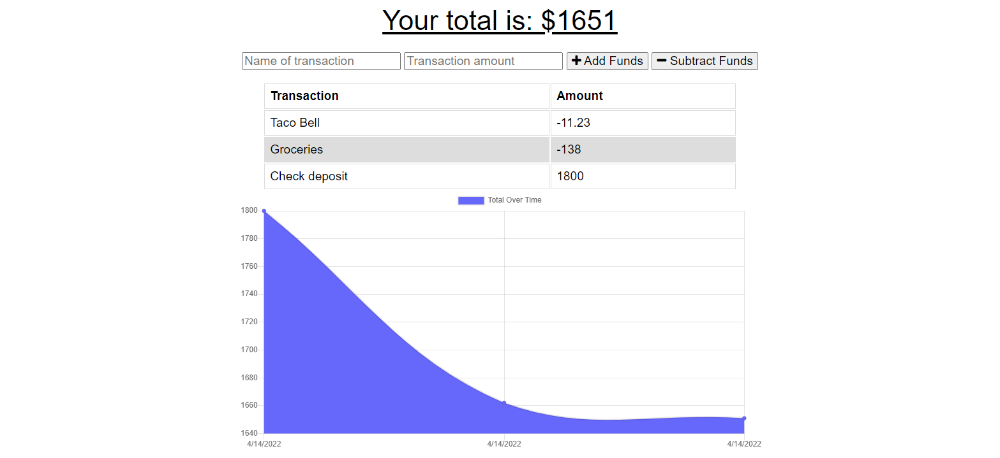

 

# Challenge 19: The Budget Tracker

## Description
This application helps you track your budget both online and offline.

## Table of Contents

* [Screenshot](#screenshot)
* [Usage](#usage)
* [Code](#code)
* [License](#license)
* [Contributing](#contributing)

## Screenshot

## Usage
Can be used to plan your budget. You can add line items that are displayed both in a list and graph.

## Code
* Javascript
* Node.js
* MongoDB
* Mongoose
* Morgan
* Compression
* IndexDB
* Express.js

## Licenses
<li><a href = "https://opensource.org/licenses/MIT">MIT</a></li><li><a href = "https://opensource.org/licenses/ISC">ISC</a></li>

## Contributing
Nickus1028